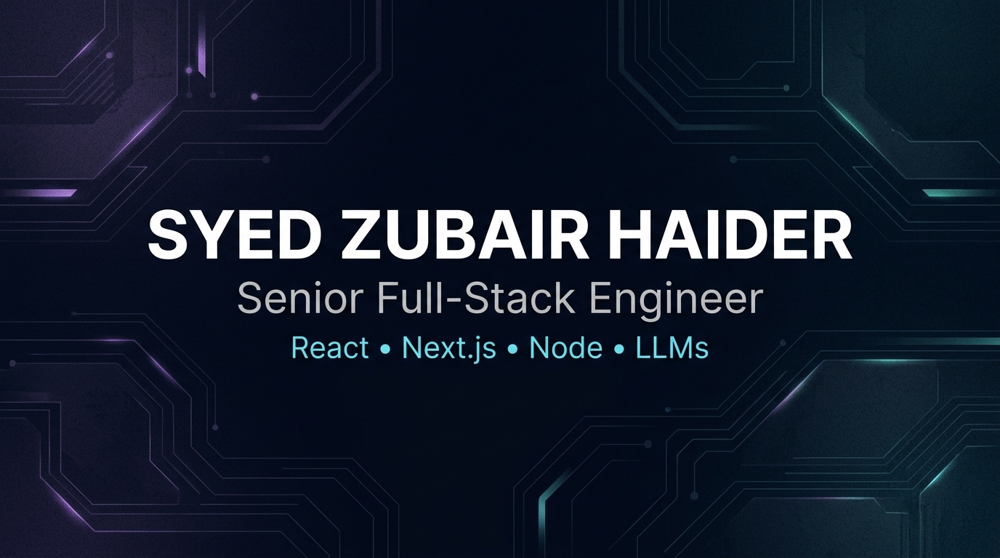

  

# Syed Zubair Haider

Senior full-stack engineer (React / Next.js / Node) with 10+ years building SaaS products, schema-first platforms, and AI-assisted features.

I ship production systems: GraphQL and REST APIs, MongoDB/Postgres data models, and Next.js UIs. Recent work includes Gemini-powered product features, a portfolio gain/loss engine, statement RAG, and Interactive Brokers tooling.

Open to **remote or Germany-based** senior frontend / full-stack roles.

- 🔗 [LinkedIn](https://www.linkedin.com/in/syed-zubair-haider/)
- 📧 zubairhaider0906@gmail.com

## Now

- Building AI-assisted product features (Gemini / LLM workflows) on Next.js + TypeScript
- [PortfolioTrack](https://github.com/zubair-builds/portfolio-track) — PSX dashboard and gain/loss engine
- [DocuMind](https://github.com/zubair-builds/documind) — statement PDFs, Gemini RAG, spend analysis
- [DocuMind app](https://github.com/zubair-builds/documind-app) — Expo client for DocuMind
- [IBKR Trading Desk](https://github.com/zubair-builds/ibkr-trading-desk) — IB Gateway, FastAPI, React dashboard

## Skills

TypeScript · React · Next.js · Node · GraphQL · MongoDB · Postgres · Gemini

Also used in production: React Native, Redux, Tailwind, Docker, AWS, GitHub Actions, Jest, Playwright.

## Experience

**Senior Full-Stack Engineer | Lexic Intelligence** · 09/2025 – Present  
AI English-learning platform (Next.js, TypeScript, MongoDB, Gemini). Context-aware meanings in under 2s; API routes with indexing under ~100ms; UI at 95+ Lighthouse.

**Senior Full-Stack Engineer | Unqork** · 08/2022 – 08/2025  
Schema-first no-code platform used by Fortune 500 finance teams (remote, US). JSON Schema data model with revisions; per-module MongoDB collections (~40% query improvement); React portals on a workspace-scoped GraphQL API.

**Senior Software Engineer | GigaLabs** · 11/2020 – 08/2022  
Flavorwiki — survey and analytics SaaS. Led React + GraphQL + Redux frontend: survey builders, dashboards, Puppeteer exports, i18n.

**Software Engineer | Kwanso** · 04/2016 – 10/2020  
CollegeAdvisor (React, GraphQL) — render time ~2s → under 1s. RCBS Matchmaster — React Native + Bluetooth for IoT powder dispensers.

## Public work

Pinned:

- [portfolio-track](https://github.com/zubair-builds/portfolio-track) — PSX portfolio dashboard (Next.js, MongoDB, Gemini)
- [documind](https://github.com/zubair-builds/documind) — unlock statement PDFs, Gemini RAG, spend analysis
- [documind-app](https://github.com/zubair-builds/documind-app) — Expo client for DocuMind
- [ibkr-trading-desk](https://github.com/zubair-builds/ibkr-trading-desk) — IB Gateway + FastAPI + React
- [mcp-notes-alerts](https://github.com/zubair-builds/mcp-notes-alerts) — personal MCP server (notes, alerts, Postgres)
- [job-orchestrator](https://github.com/zubair-builds/job-orchestrator) — job scrape → Next.js triage with Gemini

Also public: [liquidity-sweep-lab](https://github.com/zubair-builds/liquidity-sweep-lab).

Employer products (not public source): Lexic Intelligence, Unqork, Flavorwiki, CollegeAdvisor, RCBS Matchmaster.

## Education

**BS Computer Science** · National University of Computer & Emerging Sciences (FAST-NUCES) · 2011–2015
